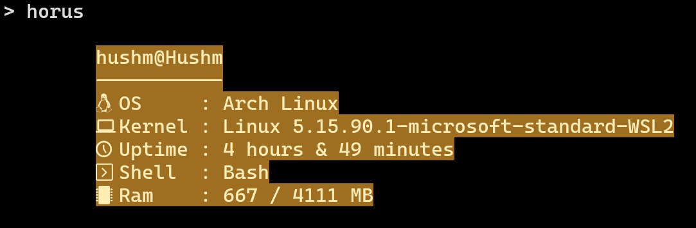
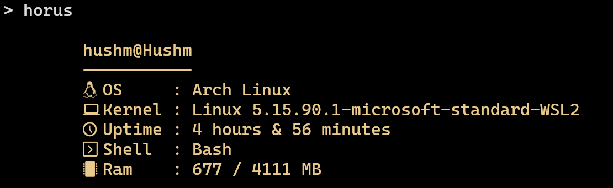
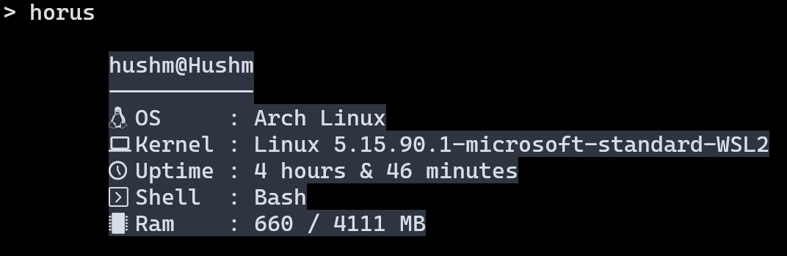
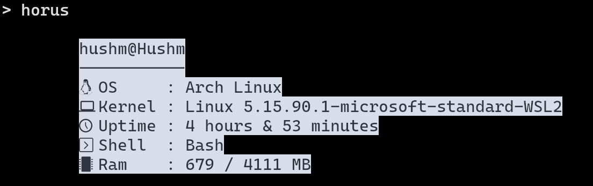

# horus

A pharaonic fetch tool for Linux written in Python.


## Screenshots

* Pharo
  
* Dark Pharo 
  
* Nord
  
* Nord inverted
  


## Installation

Download the repo using
```git
  git clone https://github.com/HushmKun/horus.git
```
Then 
```bash
  make install
```
    

## Usage/Examples

* Uses default config.  
```Bash
  horus
```

* Uses a custom made config file   
```Bash
  horus ./path/to/config
```

* Uses a C=cmdline arguments   
```Bash 
  horus -fg 100 100 100 -bg 25 25 25 
```


## Features

- Pure python (No dependecies).
- Relatively fast.
- CLI arguments.


## Roadmap

- [x] Add config file to maximize customizations.
- [x] Add argparse to allow CLI arguments.
- [ ] currently unknown, If you want to add some features open an Issue or maybe wanna do it yourself with requests.


## Acknowledgements

 - [Haruno](https://github.com/Haruno19) was my literal role model to reach.
 - [dylanaraps](https://github.com/dylanaraps) for making fetch tools in general.
 - [Thijs van Ede](https://github.com/Thijsvanede) for making the StructuredFormatter class.


## License

[MIT](https://choosealicense.com/licenses/mit/)

